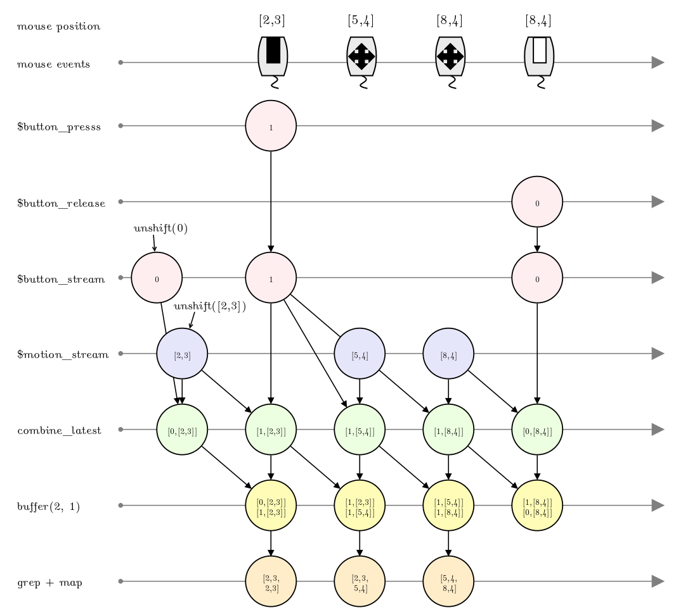

Rx.pl
=====

Microsoft Reactive Extensions Clone in Perl

What
----

Working on lists with map/grep/List::Util/etc. is fun. But the
items have to be actually in the list. Why can't we use the same powerful
operators, even when the items are not in the list, because they are events in
the future? With `Reactive` you can.

Use it for:

* Elegant async programming without callback nesting, using operators
  known from working with Perl lists
* Managing and coordinating events, e.g. start an HTTP request when
  timeout on key press if previous HTTP request was OK and arrived
  in the last 10 seconds
* Programming with stream transformations, instead of objects and
  methods. Say hello to beautiful functional designs with tightly
  controlled state, error handling, and side-effects. Replace boring
  UML diagrams with fun marble diagrams
* Stop writing and rewriting retry, timeout, throttle, buffer, window,
  counters, caching, and aggregate functions for each project. Instead
  create your processes as observables, then enjoy a rich library of
  existing operators. Reactive has combinators for each of the above
  concerns, and you get them for free as long as you can wrap your
  actions in an Observable object
* Useful for network and UI programming, easy to unit test with virtual
  time

Relationship to...
------------------

* Generators (e.g. `List::Gen`) - similar but no concept of time

* Promises / Futures - similar, but focuses on scalar values
  instead of exploiting the push/pull observable/list duality.
  Observables are richer in operators and more expressive. Promises /
  Futures can be emulated, if you wish

Dependencies
------------

Moose, aliased, Coro, EV, AnyEvent, Set::Object, Cairo, Gtk3, EV::Glib, Glib,
JSON, autobox::Core, Curses

Examples
--------

### HTTP ###

See `eg/http_*` for HTTP examples. They are the common promise/future
examples, of chain, parallel, repeat etc. 

### Sketch ###

See `eg/sketch_no_rx.pl` and `eg/sketch_rx.pl` for examples of a simple
Gtk3 sketch app with and without Rx.

Note how when we program with events in this simple app, we need to:

- implement a state machine with 2 states, pressed and not pressed, keep
  a state variable, update it inside 2 event handlers (mouse_press and 
  mouse_release)

- buffer the last point that was pressed or moved using 2 variables
  so that you can draw a line between the current and last point

- to get a point on click (press + release) and not just on mouse
  move we need to call the draw() method twice, in 2 different
  event handlers

The problem is [scattering](http://en.wikipedia.org/wiki/Aspect-oriented_software_development#Crosscutting_concerns)
of the drawing concerns between the event handlers.

We want to handle buffering, filtering, side-effects (drawing),
draw-toggle, each in one place. But we have to scatter them
between the event handlers.

Now let's do it by doing stream computations, instead of event
driven programming on state machines. Using the Reactive stream
combinators, each drawing concern will be in one place.

To create a mouse sketching program, we want to transform low-level mouse
events into a single application level event called _sketch_. The sketch
handler requires a pair of points. It will draw a line between them. We
need to make sure the handler gets called on the correct events, and with the
correct args:

- when mouse is moved, and button is pressed, we want an event, with
  the pair of points being the start and end positions of the mouse,
  so that we can draw a line between them

- on mouse press followed by release we want an event, with the pair of
  points being equal, so we can draw a point

Here is how we build the $sketch observable stream:

    $button_press   = Observable->from_mouse_press($canvas)
                                ->map(sub{ 1 });
    $button_release = Observable->from_mouse_release($canvas)
                                ->map(sub{ 0 });

    $button_stream = $button_press->merge($button_release)
                                  ->unshift(0);

    $motion_stream = Observable->from_mouse_motion($canvas)
                               ->map(sub{ [$_->x, $_->y] })
                               ->unshift( [$window->get_pointer] );

    $sketch = $button_stream->combine_latest($motion_stream)
                            ->buffer(2, 1)
                            ->grep(sub{ $_->[1]->[0] })
                            ->map(sub{ [map { @{$_->[1]} } @$_]});

When you subscribe, you will get point pairs exactly as per the spec above,
and all you need to do is draw a line (or a point if the positions are 
identical):

    $sketch->subscribe(sub{
        my ($x0, $y0, $x1, $y1) = @{$_[0]};
        draw_line($x0, $y0, $x1, $y1);
    })

The above code requires some explaining. Note how the concerns are 
not tangled anymore (buffering is in 1 combinator, draw_line() is
called only once). Also note the map/grep which make this code look
like Perl Autobox code working on regular lists, though it is working
on streams of events.

Let's go over how the $sketch observable stream is built, going from
low-level to high-level events, and showing the marble diagrams for the
combinators applied. We start by creating streams from the low-level
events:

    $button_press   = Observable->from_mouse_press($canvas)
                                ->map(sub{ 1 });
    $button_release = Observable->from_mouse_release($canvas)
                                ->map(sub{ 0 });

This gives us 2 streams, one per mouse event, which we project to booleans
using good ol' Perl map. But we want one stream not 2:

    $button_stream  = $button_press->merge($button_release)
                                   ->unshift(0);

We merge them, and start the event with 0, assuming the user starts with
button released. No way in Gtk actually to check this, but let's assume.

Here is how a pair of mouse clicks would look like in a marble diagram:

      ---time-->
    $button_press   ----------1--------------------1------------
    $button_release ----------------0----------------------0----
    merge           ----------1-----0--------------1-------0----
    unshift(0)      0---------1-----0--------------1-------0----

Another primitive stream of mouse events:    

    $motion_stream = $Observable->from_mouse_motion($canvas)
                                ->map(sub{ [$_->x, $_->y] })
                                ->unshift( [$window->get_pointer] ));

We project it using _map_ to the mouse coordinates, which is all we need from
the notification, and make sure it starts with the real initial location of the
mouse.

Now the crux of the biscuit, which we will go over line-by-line:

    $sketch = $button_stream->combine_latest($motion_stream)

_combine_latest_ passes every event from both streams. It attaches to each
notification from one of the streams, the last received value from the other
stream. So we now have a tuple of [button\_state, mouse\_position] fired
on each button press/release/mouse move. Each tuple includes the latest events
of each stream.

Here is the marble diagram for a button press, followed by some mouse motion
and a button release, as we would get it after piping through
_combine_latest_. Pi is i-th position of mouse.

      ---time-->
    $button_stream -0--------1-----------------------------0-----
    $motion_stream ---P1---------------P2--------P3--------------
    combine_latest -[0,P1]-[1,P1]----[1,P2]----[1,P3]----[0,P3]--

However, we are interested in pairs of points:    

                            ->buffer(2, 1)

Buffer(2,1) buffers every pair of events from _combine_latest_, and
shifts the buffer one event to the right. Thus we get a pair of the
latest 2 notifications. Here is the stream above piped though _buffer_:

      ---time-->
    combine_latest -[0,P1]-[1,P1]----[1,P2]----[1,P3]----[0,P3]--
                          [[0,P1],  [[1,P1],  [[1,P2],  [[1,P3], 
    buffer(2,1)    ------- [1,P1],---[1,P2],---[1,P3],---[0,P3],-
                          ]         ]         ]         ]

Turns out the we are only interested in those notifications which end in a
mouse press state. Here is a list of the possible pair types we will
receive:

    [[0,Pi],[0,Pj]] - don't draw, mouse is being moved without button press
    [[1,Pi],[1,Pj]] - draw a line [Pi,Pj] because user is sketching
    [[0,Pi],[1,Pi]] - draw a point, which is just the line [Pi,Pi]
    [[1,Pi],[0,Pi]] - mouse being released, don't draw anything

We now understand exactly when we need to draw a line, and when we need
to do nothing.

We can find the notifications we need using grep. We seek only those buffers
where the second event was fired with button pressed:

                            ->grep(sub{ $_->[1]->[0] })

Finally we map the notifications into a pair of x,y coordinates, throwing
away the mouse button state, and flattening them, so that they are ready to
be sent to the sketch subscribers:

                            ->map(sub{ [map { @{$_->[1]} } @$_]});
                            
Leading to the following marble diagram:

    ---time-->
                          [[0,P1],  [[1,P1],  [[1,P2],  [[1,P3], 
    buffer(2,1)    ------- [1,P1],---[1,P2],---[1,P3],---[0,P3],-
                          ]         ]         ]         ]
    grep + map     -------[P1,P1]---[P1,P2]---[P2,P3]------------

And here is the entire pipeline in one big image, showing a short
sketch session, from mouse events to the sketch event:

What Works
----------

* once
* range
* empty
* never
* throw
* from\_list
* subject
* publish
* materialize
* memoize
* defer
* interval
* timer
* from\_stdin
* let
* map
* scan
* expand
* grep
* catch
* count
* take
* take\_while predicate
* take\_until predicate
* take\_until observable on_next
* take\_last
* skip
* skip\_until observable on_next
* repeat
* retry
* distinct\_changes
* buffer
* push
* unshift
* merge 2 observables, N observables, observable of observables
* combine\_latest
* delay
* do
* foreach
* from\_http\_get using AnyEvent::HTTP
* from\_stdin AnyEvent line by line
* from\_curses\_stdin for AnyEvent character input
* Gtk3 from\_mouse\_press, from\_mouse\_release, from\_mouse\_motion

Differences vs. .NET Rx
-----------------------

* we don't call dispose and use Perl ref counting instead

* more Perlish operator names

TODO
----

* skip/take while/until/last, first/last
  timestamp, max/min/sum/average, fold,
  any, all, group by,
  fork join, blocking to\_list,
  ref count connectable, timestamp, time\_interval

* timeout - from subscription to 1st on\_next and timeout
  between on\_next

* decide- does this use Coro, EV, Coro::EV, Coro::AnyEvent and/or
  AnyEvent? EV works nicely with EV::Glib and Gtk3 at least on 
  Linux, AnyEvent is more common for Http work, Coro is awesome
  but is it required? Currently uses a mish-mash of string, glue, fog,
  mirrors, and every single one of the above mentioned modules

* "K 1" instead of "sub{ 1 }"

* Void and "KVoid" instead of 1 and "sub { 1 }"

* test from\_stdin with unsubscribe, maybe cleanup should reset handle

* try deep recursion

* too many similar observables inherit from Composite- tease another
  class out of there

* http client needs http\_get\_json

* support take(0)

* retry optional filter which exceptions should be retried    

* distinct\_changes should have a comparator param

* connectable observable connect() should return disposable
  instead of disconnect hack

* use ref count connectable for hot observables with retries

* take\_while/skip/until should take sub or observable, "while"
  does not include edge, "until" does

* once(1)->repeat->take(1) = infinite recursion with no notifications
  maybe move away from immediate mode scheduling?

* observable from SDL mouse/keyboard events, sockets, filesystem events

* demos- autocomplete with some terminal toolkit and menus, drag&drop,
  inactivity timer, perl news feed, perl activity graph, time flies,
  online spellchecker, image download robot, proxy, konami code, sketch 
  with bleeding ink and smoothing, erase, color change, etc. stock
  ticker with running averages, max, stddev and other window funcs,

LINKS
-----

https://github.com/richardszalay/raix/wiki/Reactive-Operators
http://search.cpan.org/~miyagawa/Corona-0.1004/lib/Corona.pm
http://search.cpan.org/~alexmv/Net-Server-Coro-1.3/lib/Net/Server/Coro.pm
http://www.youtube.com/watch?v=ClHpkn\_qxos
https://github.com/Reactive-Extensions/RxJS/wiki/Observable
https://github.com/richardszalay/raix/blob/master/source/raix/src/raix/reactive/Observable.as
http://code.google.com/p/rx-samples/source/browse/trunk/src/RxSamples.ConsoleApp/10\_FlowControlExamples.cs
https://github.com/Reactive-Extensions/RxJS-Examples
https://github.com/mono/rx/tree/master/Rx/NET/Source/System.Reactive.Linq/Reactive/Linq
http://blogs.msdn.com/b/rxteam/archive/2010/10/28/rx-design-guidelines.aspx

